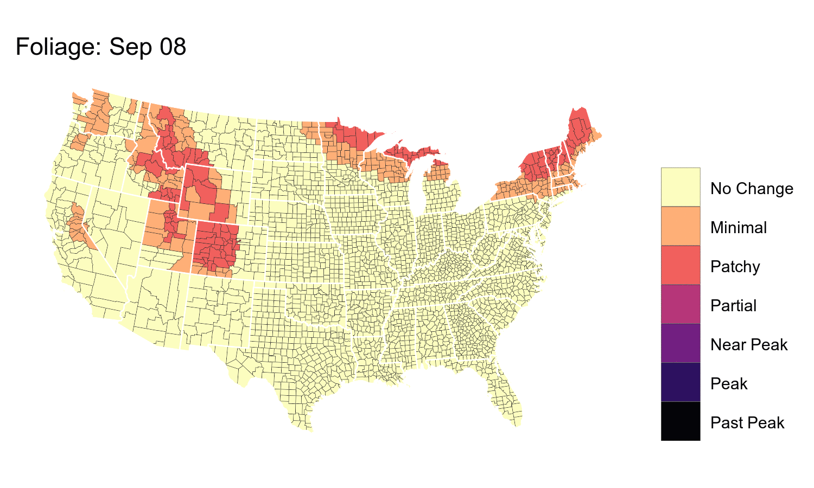
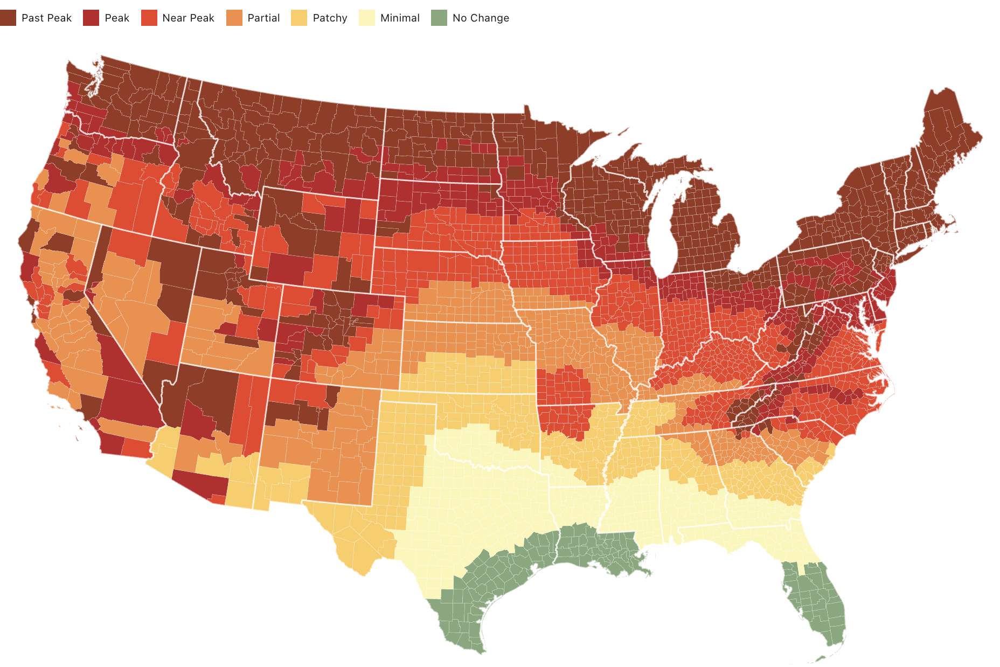
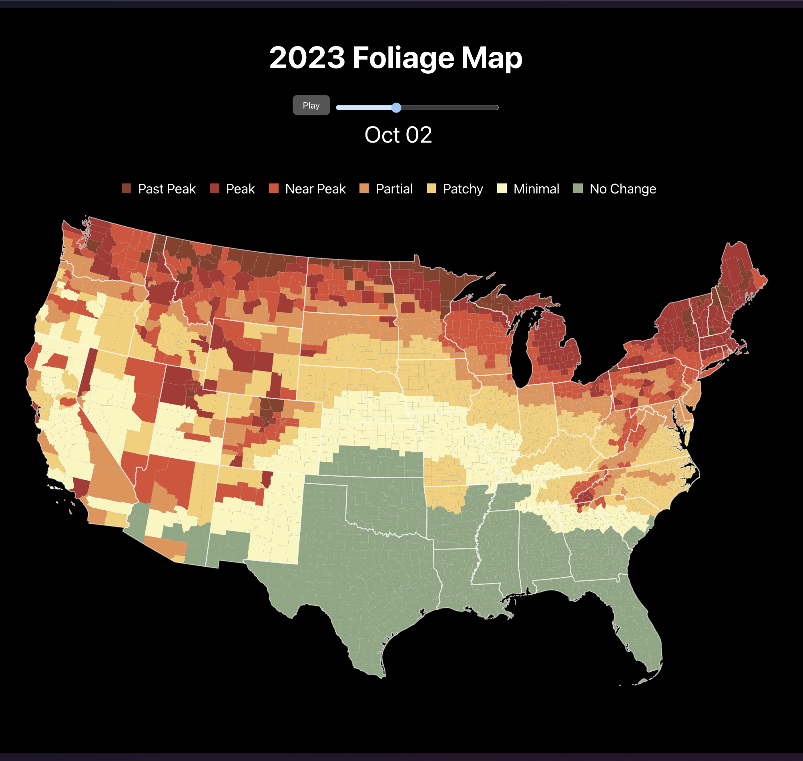

# ConUS Foliage

Starting in 2023, this project contains 

- `conus-foliage-2023/` : Quarto project version based on [this Observable Notebook](https://observablehq.com/@hrbrmstr/conus-foliage-2023). I used my [Reveal QMD](https://github.com/hrbrmstr/reveal-qmd) chrome extension.
- `foliage-lit/`: a LitElement + Vanilla JS + Tachyons  CSS + Observable Plot version (see it [here](https://rud.is/foliage-lit-plot/))
- `r-foliage/`: R code to wrangle some foliage data and create the animated gif you see below.

ObservableHQ version (tap the img to go to the notebook):

Lit + Plot + Tachyons version (tap the img to go to the live example)

